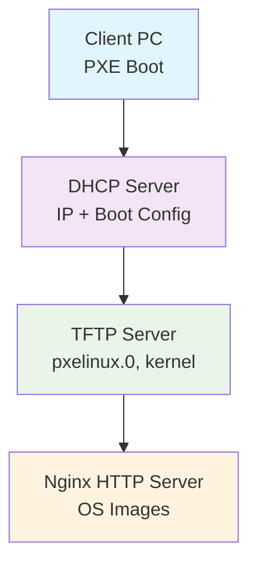

# PXE Boot Server Container

A production-grade PXE (Preboot Execution Environment) boot server containerized solution based on Rocky Linux 9, designed for network-based operating system installation and deployment.

## Features

- **DHCP Server**: Automated IP assignment and PXE boot configuration
- **TFTP Server**: Lightweight file transfer for initial boot files
- **Nginx HTTP Server**: High-performance serving of OS installation images
- **Security Hardened**: Non-root execution, minimal attack surface
- **Production Ready**: Comprehensive logging, health checks, and monitoring
- **Highly Configurable**: Environment-based configuration management

## Quick Start

```bash
# Clone or navigate to the project directory
cd pxe-boot

# Build the container
docker-compose build

# Start the PXE server
docker-compose up -d

# Check status
docker-compose ps
```

## Architecture



## Prerequisites

- Docker Engine 20.10+
- Docker Compose 2.0+
- Network interface capable of running DHCP server
- Sufficient disk space for OS images (20GB+ recommended)

## Configuration

The server is configured via environment variables in `docker-compose.yml`:

```yaml
environment:
  - DHCP_SUBNET=192.168.1.0
  - DHCP_NETMASK=255.255.255.0
  - DHCP_RANGE_START=192.168.1.100
  - DHCP_RANGE_END=192.168.1.200
  - DHCP_ROUTER=192.168.1.1
  - DHCP_DNS=8.8.8.8
  - TFTP_ROOT=/var/lib/tftpboot
  - NGINX_PORT=8080
```

## Usage

### Adding OS Images

1. Download your desired OS installation files
2. Place them in the `nginx-root/images/` directory
3. Update the PXE boot menu in `configs/pxelinux.cfg/default`

Example for Rocky Linux 9:

```bash
# Download Rocky Linux 9 ISO
curl -O https://download.rockylinux.org/pub/rocky/9/isos/x86_64/Rocky-9.3-x86_64-minimal.iso

# Mount and extract (or use ISO directly)
mkdir -p nginx-root/images/rocky9
mount -o loop Rocky-9.3-x86_64-minimal.iso /mnt
cp -r /mnt/* nginx-root/images/rocky9/
umount /mnt
```

### Network Setup

The PXE server needs to run on a network interface that can serve DHCP. Use network mode or macvlan for production:

```yaml
services:
  pxe-server:
    networks:
      pxe-net:
        driver: macvlan
        driver_opts:
          parent: eth0
```

## Security Considerations

- Runs as non-root user inside container
- Minimal package installation
- No unnecessary services exposed
- Configurable firewall rules
- Regular security updates recommended

## Monitoring

### Health Checks

```bash
# Check container health
docker-compose ps

# View logs
docker-compose logs -f pxe-server

# Check specific service status
docker exec pxe-server systemctl status dhcpd
docker exec pxe-server systemctl status tftp
docker exec pxe-server systemctl status nginx
```

### Metrics

The container exposes health check endpoints and structured logging for integration with monitoring systems like Prometheus and ELK stack.

## Troubleshooting

See [docs/troubleshooting.md](docs/troubleshooting.md) for common issues and solutions.

## Documentation

- [Installation Guide](docs/installation.md)
- [Configuration Reference](docs/configuration.md)
- [Security Guide](docs/security.md)
- [Operations Manual](docs/operations.md)
- [Contributing Guidelines](docs/contributing.md)

## Development

```bash
# Run tests
docker-compose -f docker-compose.test.yml up --abort-on-container-exit

# Security scan
docker run --rm -v $(pwd):/src aquasecurity/trivy image pxe-server:latest

# Build with security scanning
docker build --build-arg BUILDKIT_INLINE_CACHE=1 -t pxe-server .
```

## License

This project is licensed under the MIT License - see the [LICENSE](LICENSE) file for details.

## Support

For issues and questions:
1. Check the troubleshooting documentation
2. Review container logs
3. Open an issue on GitHub with relevant log output
