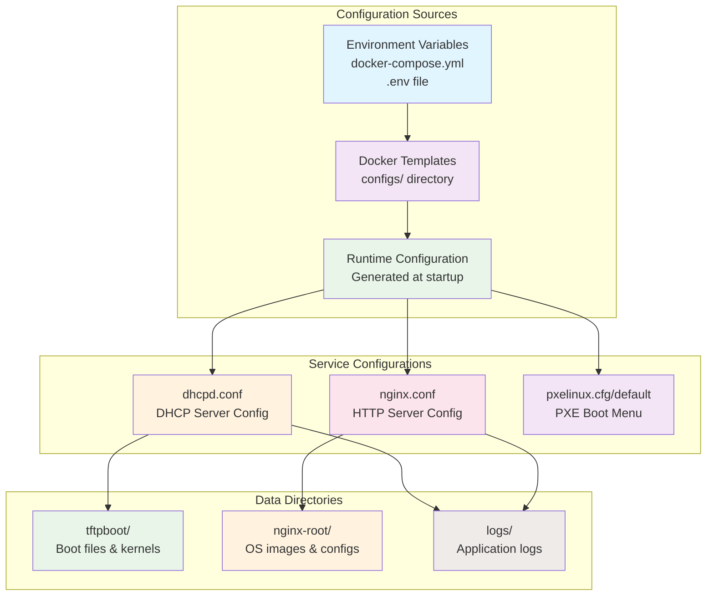

# Configuration Reference

This document provides comprehensive information about all configuration options available in the PXE Boot Server.

## Configuration Architecture

The PXE Boot Server uses a hierarchical configuration system that combines environment variables, configuration files, and templates:



## Environment Variables

### DHCP Configuration

| Variable | Default | Description |
|----------|---------|-------------|
| `DHCP_SUBNET` | `192.168.1.0` | Network subnet for DHCP |
| `DHCP_NETMASK` | `255.255.255.0` | Network mask for the subnet |
| `DHCP_RANGE_START` | `192.168.1.100` | Start of IP address range |
| `DHCP_RANGE_END` | `192.168.1.200` | End of IP address range |
| `DHCP_ROUTER` | `192.168.1.1` | Default gateway IP address |
| `DHCP_DNS` | `8.8.8.8,1.1.1.1` | DNS server(s), comma-separated |
| `DHCP_DOMAIN` | `localdomain` | DNS domain name |
| `DHCP_LEASE_TIME` | `86400` | DHCP lease time in seconds |


### Nginx Configuration

| Variable | Default | Description |
|----------|---------|-------------|
| `NGINX_PORT` | `8080` | HTTP server port |
| `NGINX_WORKER_PROCESSES` | `auto` | Number of worker processes |
| `NGINX_WORKER_CONNECTIONS` | `1024` | Worker connection limit |

### PXE Boot Configuration

| Variable | Default | Description |
|----------|---------|-------------|
| `PXE_BOOT_TIMEOUT` | `50` | Boot menu timeout in 1/10 seconds |
| `PXE_DEFAULT_BOOT` | `local` | Default boot option |

### Logging Configuration

| Variable | Default | Description |
|----------|---------|-------------|
| `LOG_LEVEL` | `info` | Logging level (debug, info, warn, error) |
| `LOG_FORMAT` | `json` | Log format (json, text) |

### Security Configuration

| Variable | Default | Description |
|----------|---------|-------------|
| `ALLOWED_NETWORKS` | `192.168.1.0/24` | Networks allowed to access services |

## Configuration Files

### DHCP Configuration (`dhcpd.conf`)

The DHCP configuration supports advanced options:

```bash
# Global options
ddns-update-style none;
authoritative;
log-facility local7;

# HTTP PXE boot options
filename "http://${HTTP_SERVER_IP}:${NGINX_PORT}/pxelinux.0";
option space pxelinux;
option pxelinux.magic code 208 = string;
option pxelinux.configfile code 209 = text;
option pxelinux.pathprefix code 210 = text;
option pxelinux.reboottime code 211 = unsigned integer 32;

# Static IP reservations
host workstation1 {
    hardware ethernet 00:11:22:33:44:55;
    fixed-address 192.168.1.50;
    option host-name "workstation1";
}
```


```

### Nginx Configuration (`nginx.conf`)

Advanced HTTP server configuration with security features:

```nginx
# Rate limiting
limit_req_zone $binary_remote_addr zone=api:10m rate=10r/s;
limit_req_zone $binary_remote_addr zone=download:10m rate=1r/s;

# Security headers
add_header X-Frame-Options "SAMEORIGIN" always;
add_header X-XSS-Protection "1; mode=block" always;
add_header X-Content-Type-Options "nosniff" always;

# Cache control for ISOs
location ~* \.(iso|img|gz|bz2|xz|tar)$ {
    expires 30d;
    add_header Cache-Control "public, immutable";
}
```

### PXE Boot Menu (`pxelinux.cfg/default`)

Boot menu configuration with multiple OS options:

```bash
# Menu configuration
MENU TITLE PXE Boot Server - Select OS to Install
MENU COLOR sel 7;37;40 #ffffffff #76a1d0ff all

# Boot entries
LABEL rocky9
    MENU LABEL Install Rocky Linux 9
    KERNEL http://${HTTP_SERVER_IP}:${NGINX_PORT}/images/rocky9/vmlinuz
    APPEND initrd=http://${HTTP_SERVER_IP}:${NGINX_PORT}/images/rocky9/initrd.img inst.repo=http://${HTTP_SERVER_IP}:${NGINX_PORT}/images/rocky9/

LABEL ubuntu2204
    MENU LABEL Install Ubuntu Server 22.04
    KERNEL http://${HTTP_SERVER_IP}:${NGINX_PORT}/images/ubuntu2204/linux
    APPEND initrd=http://${HTTP_SERVER_IP}:${NGINX_PORT}/images/ubuntu2204/initrd.gz auto url=http://${HTTP_SERVER_IP}:${NGINX_PORT}/preseed/ubuntu2204.seed
```

## Advanced Configuration Examples

### Multiple Networks

For serving multiple network segments:

```bash
# Additional subnet in dhcpd.conf
subnet 192.168.2.0 netmask 255.255.255.0 {
    range 192.168.2.100 192.168.2.200;
    option routers 192.168.2.1;
    filename "http://192.168.2.10:8080/pxelinux.0";
}
```

### Virtual Hosts in Nginx

Serve different OS repositories:

```nginx
server {
    listen 8080;
    server_name rocky.example.com;

    root /var/www/html/rocky;
    autoindex on;
}

server {
    listen 8080;
    server_name ubuntu.example.com;

    root /var/www/html/ubuntu;
    autoindex on;
}
```

### Custom Boot Menus

Create network-specific boot menus:

```bash
# Create /var/www/html/pxelinux.cfg/01-00-11-22-33-44-55
# for MAC address 00:11:22:33:44:55

DEFAULT menu.c32
PROMPT 0
TIMEOUT 50

LABEL custom_install
    MENU LABEL Custom Installation
    KERNEL http://${HTTP_SERVER_IP}:${NGINX_PORT}/images/custom/vmlinuz
    APPEND initrd=http://${HTTP_SERVER_IP}:${NGINX_PORT}/images/custom/initrd.img ks=http://${HTTP_SERVER_IP}:${NGINX_PORT}/kickstart/custom.ks
```

## Kickstart and Preseed Files

### Rocky Linux Kickstart Example

```bash
# Rocky Linux 9 kickstart
install
cdrom
lang en_US.UTF-8
keyboard us
network --bootproto=dhcp
rootpw --plaintext password
firewall --enabled
selinux --enforcing
timezone America/New_York
bootloader --location=mbr
zerombr
clearpart --all --initlabel
autopart
%packages
@core
%end
```

### Ubuntu Preseed Example

```bash
# Ubuntu 22.04 preseed
d-i debian-installer/locale string en_US
d-i keyboard-configuration/xkb-keymap select us
d-i netcfg/choose_interface select auto
d-i netcfg/get_hostname string ubuntu-server
d-i netcfg/get_domain string localdomain
d-i mirror/country string manual
d-i mirror/http/hostname string archive.ubuntu.com
d-i mirror/http/directory string /ubuntu
d-i mirror/http/proxy string
d-i passwd/root-password password r00tme
d-i passwd/root-password-again password r00tme
d-i passwd/user-fullname string Ubuntu User
d-i passwd/user-username string ubuntu
d-i passwd/user-password password ubuntu
d-i passwd/user-password-again password ubuntu
d-i clock-setup/utc boolean true
d-i time/zone string US/Eastern
d-i clock-setup/ntp boolean true
```

## Security Configuration

### Network Access Control

Limit DHCP service to specific networks:

```bash
# In dhcpd.conf
subnet 192.168.1.0 netmask 255.255.255.0 {
    # Allow only specific MAC addresses
    deny unknown-clients;
}

# Allow specific MAC addresses
host allowed-client {
    hardware ethernet 00:11:22:33:44:55;
    fixed-address 192.168.1.50;
}
```

### Nginx Security

```nginx
# Restrict access to sensitive areas
location /kickstart/ {
    allow 192.168.1.0/24;
    deny all;
    autoindex off;
}

# Rate limiting for downloads
location /images/ {
    limit_req zone=download burst=5 nodelay;
}
```

## Monitoring Configuration

### Log Aggregation

Send logs to external syslog server:

```bash
# In docker-compose.yml
logging:
  driver: syslog
  options:
    syslog-address: "tcp://logstash:514"
    tag: "pxe-server"
```

### Prometheus Metrics

Enable metrics endpoint:

```nginx
location /metrics {
    stub_status on;
    allow 10.0.0.0/8;
    deny all;
}
```

## Troubleshooting Configuration

### Common Configuration Issues

1. **DHCP not assigning IPs**:
   - Check subnet configuration
   - Verify no other DHCP servers
   - Check firewall rules

2. **HTTP timeouts**:
   - Verify file permissions (755 for directories, 644 for files)
   - Check HTTP server is accessible on port 8080
   - Test with: `curl http://server-ip:8080/pxelinux.0`

3. **Boot menu not showing**:
   - Verify pxelinux.0 is in HTTP root (/var/www/html)
   - Check pxelinux.cfg/default exists
   - Validate DHCP filename option contains correct HTTP URL

### Configuration Validation

Test configurations before deployment:

```bash
# Test DHCP config
dhcpd -t -cf /etc/dhcp/dhcpd.conf

# Test Nginx config
nginx -t

# Test PXE boot files
ls -la /var/www/html/pxelinux.0
ls -la /var/www/html/pxelinux.cfg/default
```

## Performance Tuning

### DHCP Performance

```bash
# Increase DHCP performance
subnet 192.168.1.0 netmask 255.255.255.0 {
    # Faster lease times for testing
    default-lease-time 3600;
    max-lease-time 7200;

    # More options for performance
    option dhcp-renewal-time 1800;
    option dhcp-rebinding-time 3150;
}
```

### Nginx Performance

```nginx
# Performance optimizations
worker_processes auto;
worker_connections 2048;
use epoll;

# Caching
proxy_cache_path /tmp/nginx_cache levels=1:2 keys_zone=cache:10m max_size=1g;
proxy_cache cache;
```


## Backup and Recovery

### Configuration Backup

```bash
# Backup script
#!/bin/bash
BACKUP_DIR="/opt/pxe-backup/$(date +%Y%m%d_%H%M%S)"
mkdir -p "$BACKUP_DIR"

# Backup configurations
cp -r configs/ "$BACKUP_DIR/"
cp -r scripts/ "$BACKUP_DIR/"
cp docker-compose.yml "$BACKUP_DIR/"

# Backup data (optional, can be large)
cp -r nginx-root/pxelinux.cfg "$BACKUP_DIR/"
cp -r nginx-root/kickstart "$BACKUP_DIR/"

# Create archive
tar -czf "${BACKUP_DIR}.tar.gz" "$BACKUP_DIR"
```

### Recovery Procedure

1. Stop the container
2. Restore configuration files
3. Rebuild and restart container
4. Test functionality

This configuration reference provides the foundation for customizing the PXE server to meet specific organizational requirements while maintaining security and performance best practices.
