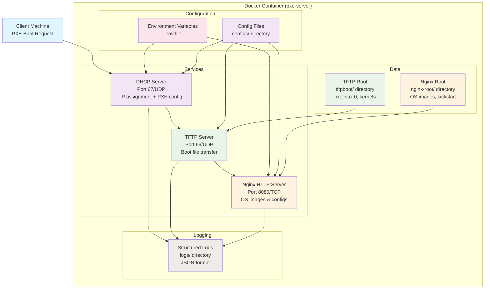

# Installation Guide

This guide provides detailed instructions for installing and configuring the PXE Boot Server.

## System Architecture

The PXE Boot Server is containerized and consists of multiple integrated services working together to provide network-based OS installation:



## Prerequisites

### System Requirements

- **Operating System**: Linux, macOS, or Windows with Docker Desktop
- **Docker**: Version 20.10 or later
- **Docker Compose**: Version 2.0 or later
- **Network Interface**: One network interface capable of serving DHCP
- **Disk Space**: Minimum 20GB for OS images, 50GB recommended
- **RAM**: Minimum 2GB, 4GB recommended

### Network Requirements

The PXE server requires special network configuration:

1. **DHCP Server Access**: The container needs to bind to UDP port 67
2. **TFTP Access**: UDP port 69 for file transfers
3. **HTTP Access**: TCP port 8080 (configurable) for OS images
4. **Network Isolation**: Consider using a dedicated network segment for PXE booting

## Installation Methods

### Method 1: Docker Compose (Recommended)

1. **Clone or download the project**:
   ```bash
   git clone <repository-url>
   cd pxe-boot
   ```

2. **Configure environment variables** (optional):
   ```bash
   cp .env.example .env
   # Edit .env with your network settings
   ```

3. **Build and start the container**:
   ```bash
   docker-compose build
   docker-compose up -d
   ```

4. **Verify installation**:
   ```bash
   docker-compose ps
   docker-compose logs -f pxe-server
   ```

### Method 2: Manual Docker Commands

1. **Build the image**:
   ```bash
   docker build -t pxe-server .
   ```

2. **Run the container**:
   ```bash
   docker run -d \
     --name pxe-server \
     --network host \
     -v ./configs:/etc/pxe:ro \
     -v ./tftpboot:/var/lib/tftpboot:rw \
     -v ./nginx-root:/var/www/html:rw \
     -v ./logs:/var/log/pxe:rw \
     -e DHCP_SUBNET=192.168.1.0 \
     -e DHCP_NETMASK=255.255.255.0 \
     pxe-server
   ```

## Network Configuration

### Host Network Mode (Recommended)

For DHCP to work properly, use host network mode:

```yaml
services:
  pxe-server:
    network_mode: host
```

### Macvlan Network (Alternative)

For dedicated network interface:

```yaml
services:
  pxe-server:
    networks:
      pxe-net:
        driver: macvlan
        driver_opts:
          parent: eth0  # Change to your interface
networks:
  pxe-net:
    driver: macvlan
    driver_opts:
      parent: eth0
    ipam:
      config:
        - subnet: 192.168.1.0/24
          gateway: 192.168.1.1
```

## Configuration

### Environment Variables

Create a `.env` file or set environment variables:

```bash
# Network Configuration
DHCP_SUBNET=192.168.1.0
DHCP_NETMASK=255.255.255.0
DHCP_RANGE_START=192.168.1.100
DHCP_RANGE_END=192.168.1.200
DHCP_ROUTER=192.168.1.1
DHCP_DNS=8.8.8.8,1.1.1.1

# Service Configuration
TFTP_ROOT=/var/lib/tftpboot
NGINX_PORT=8080

# PXE Configuration
PXE_BOOT_TIMEOUT=50
PXE_DEFAULT_BOOT=local
```

### Advanced Configuration

For complex networks, edit the configuration files in `configs/`:

- `dhcpd.conf`: DHCP server configuration
- `nginx.conf`: HTTP server configuration
- `tftp`: TFTP server configuration
- `pxelinux.cfg/default`: PXE boot menu

## Adding OS Images

### Red Hat Enterprise Linux 9 Example

1. **Download the ISO**:
   ```bash
   wget https://access.redhat.com/downloads/content/rhel---9/9.4/x86_64/images/rhel-9.4-x86_64-boot.iso
   ```

2. **Mount and extract**:
   ```bash
   mkdir -p nginx-root/images/rhel9
   mount -o loop rhel-9.4-x86_64-boot.iso /mnt
   cp -r /mnt/* nginx-root/images/rhel9/
   umount /mnt
   ```

3. **Extract kernel and initrd**:
   ```bash
   cp nginx-root/images/rhel9/images/pxeboot/vmlinuz tftpboot/images/rhel9/
   cp nginx-root/images/rhel9/images/pxeboot/initrd.img tftpboot/images/rhel9/
   ```

### Rocky Linux 9 Example

1. **Download the ISO**:
   ```bash
   wget https://download.rockylinux.org/pub/rocky/9/isos/x86_64/Rocky-9.3-x86_64-minimal.iso
   ```

2. **Mount and extract**:
   ```bash
   mkdir -p nginx-root/images/rocky9
   mount -o loop Rocky-9.3-x86_64-minimal.iso /mnt
   cp -r /mnt/* nginx-root/images/rocky9/
   umount /mnt
   ```

3. **Extract kernel and initrd**:
   ```bash
   cp nginx-root/images/rocky9/images/pxeboot/vmlinuz tftpboot/images/rocky9/
   cp nginx-root/images/rocky9/images/pxeboot/initrd.img tftpboot/images/rocky9/
   ```

### Ubuntu Server Example

1. **Download netboot files**:
   ```bash
   mkdir -p tftpboot/images/ubuntu2204
   cd tftpboot/images/ubuntu2204
   wget http://archive.ubuntu.com/ubuntu/dists/jammy/main/installer-amd64/current/legacy-images/netboot/ubuntu-installer/amd64/linux
   wget http://archive.ubuntu.com/ubuntu/dists/jammy/main/installer-amd64/current/legacy-images/netboot/ubuntu-installer/amd64/initrd.gz
   ```

2. **Create preseed file** (optional):
   ```bash
   # nginx-root/preseed/ubuntu2204.seed
   d-i debian-installer/locale string en_US
   d-i keyboard-configuration/xkb-keymap select us
   # ... additional preseed configuration
   ```

## Firewall Configuration

Ensure the following ports are open:

- **UDP 67**: DHCP server
- **UDP 69**: TFTP server
- **TCP 8080**: HTTP server (configurable)

### iptables Example

```bash
# Allow DHCP, TFTP, and HTTP
iptables -A INPUT -p udp --dport 67 -j ACCEPT
iptables -A INPUT -p udp --dport 69 -j ACCEPT
iptables -A INPUT -p tcp --dport 8080 -j ACCEPT
```

### firewalld Example

```bash
firewall-cmd --permanent --add-port=67/udp
firewall-cmd --permanent --add-port=69/udp
firewall-cmd --permanent --add-port=8080/tcp
firewall-cmd --reload
```

## Troubleshooting Installation

### Common Issues

1. **DHCP not working**:
   - Check if another DHCP server is running
   - Verify network interface permissions
   - Check DHCP logs: `docker-compose logs pxe-server | grep dhcpd`

2. **TFTP timeout**:
   - Verify TFTP port is open
   - Check file permissions in tftpboot directory
   - Test TFTP: `tftp server-ip -c get pxelinux.0`

3. **HTTP not accessible**:
   - Verify NGINX_PORT environment variable
   - Check nginx logs: `docker-compose logs pxe-server | grep nginx`
   - Test HTTP: `curl http://server-ip:8080/health`

### Logs and Debugging

```bash
# View all logs
docker-compose logs -f pxe-server

# Check specific service logs
docker exec pxe-server tail -f /var/log/dhcpd.log
docker exec pxe-server tail -f /var/log/nginx/access.log
docker exec pxe-server tail -f /var/log/pxe/startup.log

# Run health check
docker exec pxe-server /usr/local/bin/healthcheck.sh
```

## Upgrading

To upgrade the PXE server:

1. **Stop the current container**:
   ```bash
   docker-compose down
   ```

2. **Pull latest changes**:
   ```bash
   git pull
   ```

3. **Rebuild and restart**:
   ```bash
   docker-compose build --no-cache
   docker-compose up -d
   ```

## Production Deployment

For production environments:

1. **Use external logging**: Configure syslog or ELK stack
2. **Enable monitoring**: Set up Prometheus metrics
3. **Configure backups**: Regular backup of configurations and images
4. **Security hardening**: Review and apply security policies
5. **Load balancing**: Consider multiple PXE servers for high availability

See the [Operations Manual](operations.md) for detailed production procedures.
